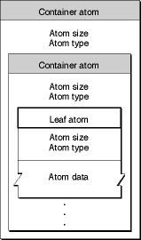
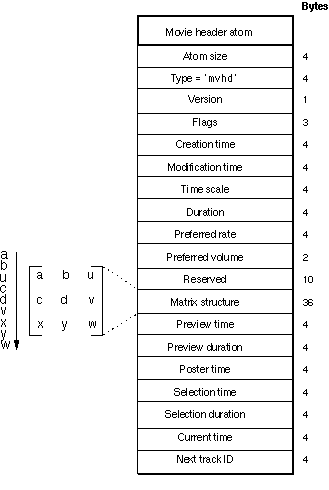
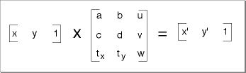
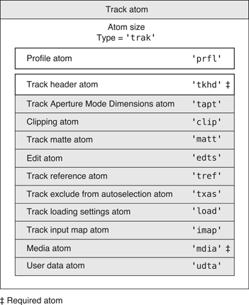

MP4 Parsing
====


The goal of this combinator is write a parser that can parse the header of a valid MP4 video file.  To play a video file, the player needs meta information about the video: where each packet data is in the file, how long to play the packet, whether a packet is a keyframe, information about how to decode the player, the height and width of each frame, etc.  

## Table of Contents

- [Atoms](#atoms)
- [Defining Types](#defining-types)
- [Building up!](#building-up)
- [Parsing 'mvhd'](#parsing-mvhd)
- [Parsing 'tkhd'](#parsing-tkhd)
- [Defining outer atoms](#defining-outer-atoms)
- [Putting it all together](#putting-it-all-together)

## Atoms


This metadata in the MP4 header is structured in blocks of data called `atoms`.  They look like this

  

The atom size is a 4 byte sequence, followed by a 4 byte lowercase ascii identifier of what an atom is.  Atoms can container other atoms, as well as contain certain data.  

Here is an overview of what the main movie atom looks like

 

Some atoms are optional, and unknown atoms (i.e user defined ones) should be skipped.  

For more detailed information on what each atom does, check the [quicktime MP4 specification](https://developer.apple.com/library/mac/documentation/QuickTime/QTFF/QTFFPreface/qtffPreface.html).

[[Top]](#table-of-contents)

## Defining types

Lets get parsing! 

First lets define some useful types

```fsharp
type VideoState = { IsAudio: bool; CurrentStatePosition: int64 }

type VideoParser<'Return> = Parser<'Return, System.IO.Stream, byte[], VideoState>
```

This lets us know that we have a user state of the record type `VideoState` and that we are working on a stream and will be consuming bytes. 

Later on, its going to be handy to know where each atom started in the stream. The reason is that we need to make sure we consume each atom fully. If an atom is size 500, but we only consumed 300, something is wrong.  This is why we have a field in the user state, `CurrentStatePosition`, to track where the stream position is. We'll also need to know where in the context of the parse sequence we are, whether we are parsing a video track or an audio track. This is why we have the `IsAudio` field. 

Let's also create a network order binary parser class, since MP4 is written in network order

```fsharp
let bp = new BinParser<_>(Array.rev)
```

Also, every atom has a size and a name, so lets track that:

```fsharp
type AtomBase = {
    Size: uint32
    Name: string
}
```

[[Top]](#table-of-contents)

## Building Up

When building combinators, you should build from the smallest element you have. In this case, the smallest element is the atom size, and the atom name.  We need a way to match certain atoms.  

```fsharp
/// <summary>
/// Matches a string asn ascii byte sequence in the steam
/// </summary>
/// <param name="value"></param>
let name (value:string) : VideoParser<_> = 
 	bp.matchBytes (Encoding.ASCII.GetBytes value) |>> Encoding.ASCII.GetString
```

This parser will succeed if the ascii byte sequence matches the start of the stream.

Lets also define how to get the atom size

```fsharp
let atomSize : VideoParser<_> = bp.uint32
```

This parser returns a `uint32` which is a 4 byte sequence from the stream

Next, lets make a parser that tracks the position of the stream since this is good info to have:

```fsharp
/// <summary>
/// Parser that sets the user state with the current stream position
/// </summary>
let trackStatePosition = 
    statePosition >>= fun pos ->
    getUserState  >>= fun state ->
    setUserState { state with CurrentStatePosition = pos }
```

Now lets finally get the basics of an atom

```fsharp
/// <summary>
/// Extracts an atom of the target name (if it exists)
/// and keeps track in the user state what the starting position
/// of this atom is
/// </summary>
/// <param name="id"></param>
let atom id : VideoParser<_> =
    attempt (
        trackStatePosition >>= fun _ ->
        atomSize >>= fun size ->
        name id >>= fun name ->               
        preturn 
            {
                Size = size
                Name = name
            }
    )
```

This parser takes a string and returns an `AtomBase` record.  The `attempt` is there in case the atom at the state stream isn't the atom we wanted (by calling `id`). In that case the `name` parser would fail, and the `atom` parser would backtrack.

Now that the basics are there, lets make some more useful blocks. Lots of atoms have a 4 byte sequence representing the version and flags of an atom. The version is 1 byte, and the flags is 3 bytes. Lets parse that:

```fsharp
let versionAndFlags : VideoParser<_> = 
    bp.byte1 |>> bp.byteToUInt  >>= fun version ->
    bp.byte3 |>> bp.toUInt24    >>= fun flags ->
    preturn 
        {
            Version = version
            Flags = flags
        }
```

Some atoms define a date field, which is defined by the number of seconds since midnight January 1st, 1904. Below we can consume 4 bytes, and pipe that to a composed function that converts to a uint32, then to a double, then adds that number of seconds to the base date.

```fsharp
let private timeSince1904 = new DateTime(1904, 1, 1, 0, 0, 0, DateTimeKind.Utc);

let date : VideoParser<_> = bp.byte4 |>> (bp.toUInt32 >> Convert.ToDouble >> timeSince1904.AddSeconds)
```

[[Top]](#table-of-contents)

## Parsing "mvhd"

At this point we can parse a simple atom. For example, this is the `mvhd` (movie header) atom:



And the matrix is parsed by where `a, b, c, d, tx, ty` are packed `16.16` fixed point numbers, and `u, v, w` are packed `2.10` fixed point numbers.



Here is the parser that defines this structure

```fsharp
let mvhd : VideoParser<_> = 
    atom "mvhd"                 >>= fun id -> 
    versionAndFlags             >>= fun vFlags ->
    date                        >>= fun creationTime ->
    date                        >>= fun modificationTime ->
    bp.uint32                   >>= fun timeScale ->
    bp.uint32                   >>= fun duration ->
    bp.uint32                   >>= fun rate ->
    bp.uint16                   >>= fun volume ->
    bp.skip 10                  >>= fun reserved ->
    matrix                      >>= fun matrix -> 
    bp.uint32                   >>= fun previewTime ->
    bp.uint32                   >>= fun previewDuration ->
    bp.uint32                   >>= fun posterTime ->
    bp.uint32                   >>= fun selectionTime ->
    bp.uint32                   >>= fun selectionDuration ->
    bp.uint32                   >>= fun currentTime ->      
    bp.uint32                   >>= fun nextTrackId ->
    preturn {
        Atom = id
        VersionAndFlags = vFlags
        CreationTime = creationTime
        ModificationTime = modificationTime
        TimeScale = timeScale
        Matrix = matrix
        PreviewTime = previewTime
        PreviewDuration = previewDuration
        PosterTime = posterTime
        SelectionTime = selectionTime
        CurrentTime = currentTime
        NextTrackId = nextTrackId
        SelectionDuration = selectionDuration
    } |>> MVHD
```

Where we've already seen the `atom` parser which gives you the name and size, and we've already seen the `versionAndFlags` parser which gives you the version and flags, and we've already seen the `date` parser.  The only new parser here is the `matrix` parser which looks like this

```fsharp
let ``16.16`` = 
    bp.uint32 >>= fun i ->
    preturn <| i / uint32(pown 2 16)

let ``2.10`` = 
    bp.uint32 >>= fun i ->
    preturn <| i / uint32(pown 2 30)

let matrixRow = 
    ``16.16``   >>= fun x1 ->
    ``16.16``   >>= fun x2 ->
    ``2.10``    >>= fun x3 ->
    preturn [|x1; x2; x3|]

let matrix : VideoParser<_> = 
    exactly 3 matrixRow >>|. List.toArray >>= fun rows ->

    preturn <| Array2D.init 3 3 (fun i j -> rows.[i].[j])

```

[[Top]](#table-of-contents)

## Parsing "tkhd"

Another example is of the `tkhd` atom


Should be pretty easy now:

```fsharp
let tkhd : VideoParser<_> = 
    atom "tkhd"     >>= fun id ->
    versionAndFlags >>= fun vFlags ->
    date        >>= fun creationTime ->
    date        >>= fun modificationTime ->
    bp.uint32   >>= fun trackId ->
    bp.uint32   >>= fun reserved ->
    bp.uint32   >>= fun duration ->    
    bp.skip 8   >>= fun reserved2 ->    
    bp.uint16   >>= fun layer ->
    bp.uint16   >>= fun alteranteGroup ->
    bp.uint16   >>= fun volume ->
    bp.uint16   >>= fun reserved3 ->
    matrix      >>= fun matrix ->
    bp.uint32   >>.. bp.shiftR 16 >>= fun width ->
    bp.uint32   >>.. bp.shiftR 16 >>= fun height ->
    preturn {
        Atom  = id
        VersionAndFlags = vFlags
        CreationTime  = creationTime
        ModificationTime  = modificationTime
        TrackId = trackId
        Duration = duration
        Layer = layer
        AlternateGroup = alteranteGroup
        Volume = volume
        Height = width
        Width = height
    } |>> TKHD
```

[[Top]](#table-of-contents)

## Defining outer atoms

The last few atoms I showed are considered "leaf" atoms, which don't hold any other atoms. Now lets go over what container atoms look like:

Let's look at a `trak` atom


```fsharp
let trak =         
    fullConsume "trak" 
        (fun id ->        
            tkhd <|> 
            mdia <|> 
            edts <|>
            (unknown |>> TrakTypes.UNKNOWN)
        ) |>> TRAK
```

Notice how the spec defines a `trak` atom to have many different kinds of sub atoms, however most of these aren't usually in MP4 files.  You can see which atoms are required by the indicator.  

If we wanted to be complete, we could fully parse all these atoms, but that's overkill for most scenarios.  Instead, lets map all valid atoms that aren't in our defined atom list to be `unknown` atoms and let's write a parser called `fullConsume` that will take care of applying the known atoms we've defined repeatedly until the entire `trak` atom is consumed.  

First, the `unknown` parser

```fsharp
/// <summary>
/// Consumes an atom if its name is a valid 4 letter lowercase ascii sequence
/// </summary>
let unknown : VideoParser<_> =         
    trackStatePosition 	>>.     
    atomSize			>>= fun size ->
    stringId 			>>= fun name ->     

    let intValues = name.ToCharArray() |> Array.map (int)  
    let nonAscii = Array.exists(fun i -> i < 97 || i > 122) intValues 

    if nonAscii then 
        pzero 
    else                
        skipRemaining size 8 >>. 
        preturn 
            {
                Size = size
                Name = name
            }           

```

Since the `unknown` parser doesn't go through the normal `atom` parser (which auto tracks the state position in the user state), we need to explicity call `trackStatePosition`.  Then we read the size, and a stringId (4 byte ascii sequence), and see if the name is a valid lowercase ascii name. If it isn't, then we've probably read into some garbage data and we should fail with `pzero`.  Otherwise, lets consume the whole thing, skipping all of its contents (the skip 8 skips the already consumed name and size) it and return an `AtomBase` type.

The `<|>` operator is applied in order (it's greedy), so if we put the `unknown` parser last, we know that all the parsers before it have already been tried against the stream and have failed.  

Now let's build the `fullConsume` parser. What we want to do is consume a parser if the current atom size hasn't been fully taken. So, if `tkhd` is 500 bytes long, we want to make sure we continue to apply the parsers until the consumed amount is equal to the expected size.

Thankfully we're tracking the stream position along with the user state, and we can use the `satisfyUserState` function that consumes if the user state predicate passes to accomplish this:

```fsharp
/// <summary>
/// Runs the parser while the user state
/// stream pos - start < size
/// </summary>
/// <param name="start"></param>
/// <param name="size"></param>
/// <param name="parser"></param>
let takeIfAtomNotConsumed start expectedSize parser = 
    let shouldConsume = fun (s:VideoState) -> 
                                let consumed = s.CurrentStatePosition - (int64)start
                                consumed < (int64)expectedSize
                            
    satisfyUserState shouldConsume parser
```

Then all we have to do is apply this `takeIfAtomNotConsumed` parser many times

```fsharp
/// <summary>
/// runs the parser many times until the 
/// target amount is consumed (making sure the atom has been fully consumed)
/// </summary>
/// <param name="name"></param>
/// <param name="getParser"></param>
let fullConsume name getParser = 
    atom name 		>>= fun id ->        
    getUserState 	>>= fun state ->

    let parser = getParser id

    takeIfAtomNotConsumed state.CurrentStatePosition id.Size parser |> many
```

`getParser` is a function that takes the atom initial parsed state (an `AtomBase` that contains size and name) and returns a parser to use.  This way, the parser that is returned can close on the initial parsed value if it needs to.

Now lets check the initial `trak` parser again

```fsharp
let trak =         
    fullConsume "trak" 
        (fun id ->        
            tkhd <|> 
            mdia <|> 
            edts <|>
            (unknown |>> TrakTypes.UNKNOWN)
        ) |>> TRAK
```

Hopefully you can see that the `unknown` parser will act as a *catch-all* for any unknown types, but it won't consume *past* the end of the container atom.

[[Top]](#table-of-contents)

## Putting it all together

In the end the main `video` parser entry point looks like this

```fsharp
let video : VideoParser<_> = many (choice[  attempt ftyp; 
                                            moov; 
                                            mdat; 
                                            free;]) .>> eof
```

[[Top]](#table-of-contents)